<<<<<<< HEAD
# Análise de churn

Este repositório tem como finalidade realizar uma análise em
atributos relacionados ao *Churn* de clientes.  

## Instalação

*use python >= 3.6*
```
pip3 install -r requirements.txt
```

## Como executar

```
pip3 main.py
```

## Saída

São executadas inicialmente rotinas para exploração da base de dados e 
etapas de pré-processamento para limpeza e formatação. Em ambos a saída é 
textual no console. Em seguida são gerados gráficos para interpretação de 
correlação entre os atributos existentes e o objeto alvo *Churn*.
Ao final é empregado um modelo de regressão logística para estimar a
probabilidade de *Churn*, e o mesmo é salvo no arquivo.

As etapas são descritas em maiores detalhes a seguir.


---

#### Exploração da base de dados
Neste estudo foi utilizado a base de dados [database.csv](data/database.csv).
Esta base consiste de 7043 amostras (clientes) e 23 atributos distintos,
sendo estes:

```
customerID, gender , SeniorCitizen, Partner, Dependents, tenure, PhoneService,
MultipleLines, code, InternetService, OnlineSecurity, OnlineBackup,
DeviceProtection, TechSupport, StreamingTV, StreamingMovies, Contract, Hash,
PaperlessBilling, PaymentMethod, MonthlyCharges, TotalCharges, Churn
```

Foram identificados alguns atributos com dados faltantes, (campo vazio ou espaço
em branco ' '), que podem vir a ser removidos do estudo.

|atributo        |quantidade de dados faltantes|
| ---            | ---|
|customerID      |3459|
|OnlineSecurity  |34|
|TotalCharges    |11|

Em seguida, é reportado uma amostra de quais informações são contidas em cada atributo,
sendo possível identificar que alguns campos possuem grafia diferente, porém
mesmo significado, podendo ser agrupados (ex.: [no,No,0] = 0).

Além disso, observando as colunas *Hash* e *code* pode se inferir que são uma
decomposição da coluna *customerID*, e tas três existem unicamente  para
identificar o usuário, não são elementos que implicam no resultado de *Churn*.

|Atributo | Amostra de dados |
| --- | --- |
|customerID | [nan '5575-GNVDE' '7795-CFOCW' '9237-HQITU' '6388-TABGU' '0280-XJGEX']|
|gender | ['Female' 'Male']|
|SeniorCitizen | [0 1]|
|Partner | ['Yes' 'No' 'no' 'yes' '0' '1']|
|Dependents | ['No' 'Yes' 'no' 'yes' '0' '1']|
|tenure | [ 1 34  2 45  8 22 10 28 62 13]|
|PhoneService | ['No' 'Yes' 'yes' 'no' '1' '0']|
|MultipleLines | ['No phone service' 'No' 'Yes' 'no' 'yes' 'no phone service' '0' '1']|
|code | [7590 5575 3668 7795 9237 9305 1452 6713 7892 6388]|
|InternetService | ['DSL' 'Fiber optic' 'No' 'no']|
|OnlineSecurity | ['No' 'Yes' 'No internet service' 'yes' 'no internet service' 'no' nan '0' '1']|
|OnlineBackup | ['Yes' 'No' 'No internet service' 'no' 'no internet service' 'yes' '0' '1']|
|DeviceProtection | ['No' 'Yes' 'No internet service' 'no' 'no internet service' 'yes' '0' '1']|
|TechSupport | ['No' 'Yes' 'No internet service' 'no' 'no internet service' 'yes' '0' '1']|
|StreamingTV | ['No' 'Yes' 'No internet service' 'no' 'no internet service' 'yes' '0' '1']|
|StreamingMovies | ['No' 'Yes' 'No internet service' 'no' 'no internet service' 'yes' '1' '0']|
|Contract | ['Month-to-month' 'One year' 'Two year']|
|Hash | ['75VEG' 'GNVDE' 'QPYBK' 'CFOCW' 'HQITU' 'CDSKC' 'KIOVK' 'OKOMC' 'POOKP' 'TABGU']|
|PaperlessBilling | ['Yes' 'No' 'yes' 'no' '1' '0']|
|PaymentMethod | ['Electronic check' 'Mailed check' 'Bank transfer (automatic)' 'Credit card (automatic)']|
|MonthlyCharges | [ 29.85  56.95  53.85  42.3   70.7   99.65  89.1   29.75 104.8   56.15]|
|TotalCharges | ['29.85' '1889.5' '108.15' '1840.75' '151.65' '820.5' '1949.4' '301.9']|
|Churn |['No' 'Yes' 'yes' 'no' '0' '1']|


#### Pré-processamento

Esta etapa tem como intuito realizar a  limpeza e formatação dos dados.

Uma vez identificado que as colunas *['customerId','code','Hash']* não
influenciam no resultado de *Churn*, estas foram removidas do conjunto de dados.

45 amostras que apresentavam dados faltantes foram removidas da base.

Os atributos categóricos (elementos que podem ser separados em categorias, 
ex.: *Partner*) tiveram seus campos semelhantes agrupados, evitando redundância
(ex.: [no,No,0] foram substituídos por 0).

O campo *TotalCharges* foi convertido para o formato numérico *float*,
pois este estava formatado com o tipo textual *str*

Após o tratamento, segue uma amostra do conjunto de dados atualizado:

|Atributo | Amostra de dados |
| --- | --- |
|gender |['female' 'male']|
|SeniorCitizen |[0 1]|
|Partner |[1 0]|
|Dependents |[0 1]|
|tenure |[ 1 34  2 45  8 22 10 28 62 13]|
|PhoneService |[0 1]|
|MultipleLines |['no phone service' 0 1]|
|InternetService |['dsl' 'fiber optic' 0]|
|OnlineSecurity |[0 1 'no internet service']|
|OnlineBackup |[1 0 'no internet service']|
|DeviceProtection |[0 1 'no internet service']|
|TechSupport |[0 1 'no internet service']|
|StreamingTV |[0 1 'no internet service']|
|StreamingMovies |[0 1 'no internet service']|
|Contract |['month-to-month' 'one year' 'two year']|
|PaperlessBilling |[1 0]|
|PaymentMethod |['electronic check' 'mailed check' 'bank transfer (automatic)' 'credit card (automatic)']|
|MonthlyCharges |[ 29.85  56.95  53.85  42.3   70.7   99.65  89.1   29.75 104.8   56.15]|
|TotalCharges |[  29.85 1889.5   108.15 1840.75  151.65  820.5  1949.4   301.9  3046.05|
| 3487.95]|
|Churn |[0 1]|

#### Análise de dados

No gráfico abaixo é demonstrado a proporção de entradas separadas pelas
categorias *Churn* e *No Churn*, sendo possível identificar que a base é 
desbalanceada, aonde aproximadamente 2/3 dos dados são da classe *No Churn*.


Os gráficos a seguir relatam a distribuição de *Churn* em relação à cada
atributo, sendo *No Churn* em azul e *Churn* em laranja.
O eixo horizontal representa a ausência (0) e 
presença (1) do atributo em questão, enquanto o eixo vertical indica a
proporção dos dados (normalizados entre 0.0 e 1.0)

Observando os dados do atributo *gender*, as variáveis *female* e *male*
apresentam distribuições semelhantes, podendo então inferir que este atributo
não interfere no *Churn*.

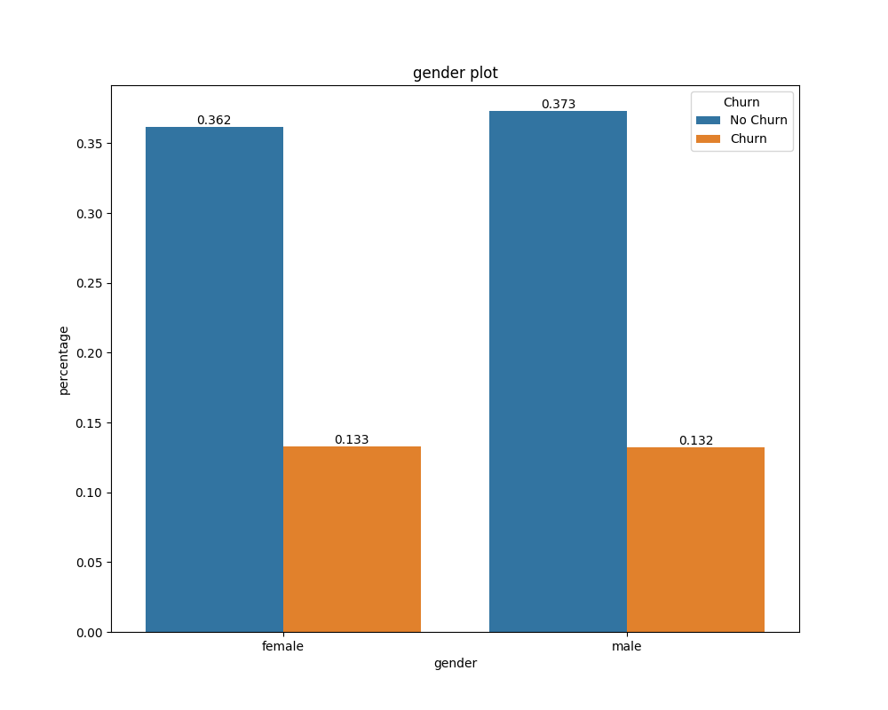

Já em relação ao atributo *Senior Citizen*, 84% de sua população não é 
sênior (representado pelo valor 0 no eixo horizontal da figura), 
e esta faixa etária é menos propensa ao *Churn*, visto que a razão entre
*Churn/No Churn* é de 31%, enquanto a população sênior, embora que represente
apenas 16% do total, tem uma razão de *Churn/No Churn* de aproximadamente 71%.

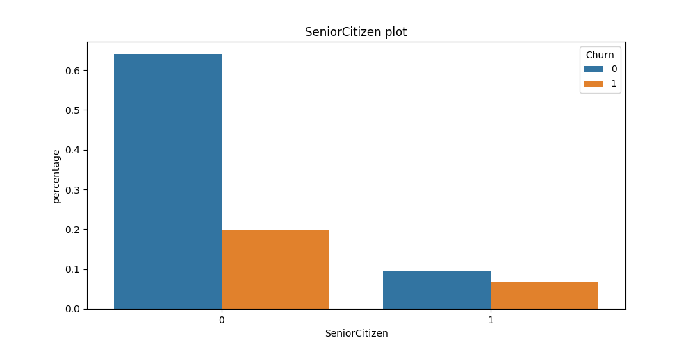

Na figura que relata o atributo *Partner* fica evidente que clientes que não 
possuem parceiros (valor 0 no eixo horizontal da figura) são mais propensos
ao *Churn*, apresentando a razão de 48%, o dobro da razão encontrada nos
clientes que possuem parceiros.

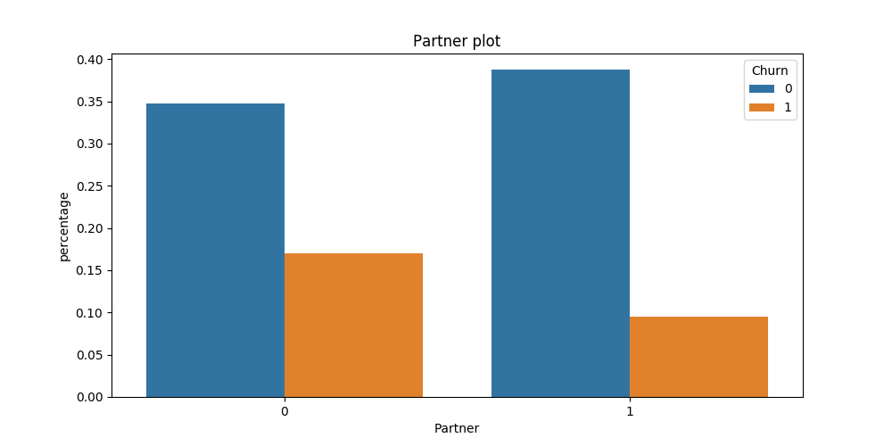

Os valores contidos no atributo *Dependents* demonstram que clientes sem
dependentes possuem maior taxa de *Churn* (45%). Já clientes com dependentes
possuem taxa de *Churn* de 18%.

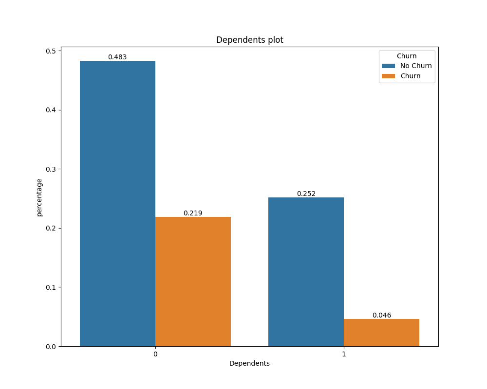

No que tangem as três modalidades de contrato (*Contract*), a espécie
*Month-to-month* lidera a proporção de taxa de *Churn* com 71%, o que é
esperado, dado que este tipo de vínculo é mais curto e portanto depende de
maior engajamento do cliente em realizar renovações mensais. 

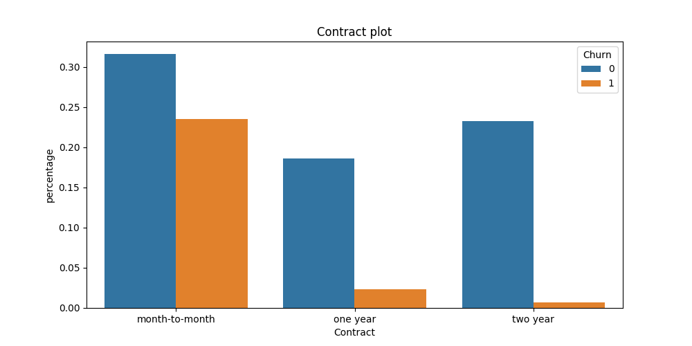

Consumidores que utilizam a opção de recebimento de conta *Paperless*
são mais suscetíveis a *Churn*, conforme a figura abaixo:

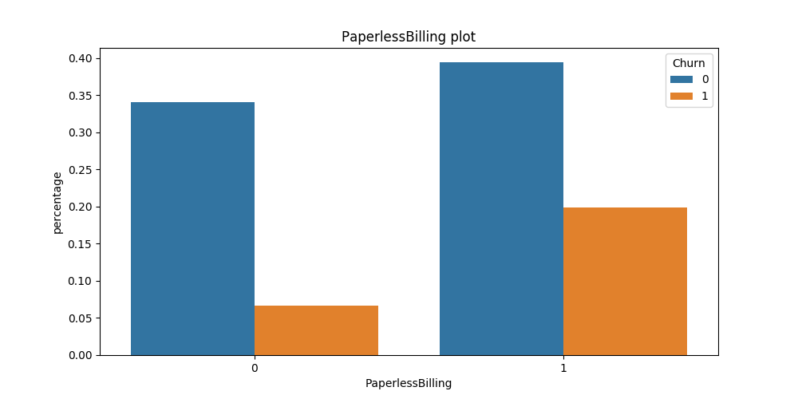

Dentre os quatro tipos de pagamento (*PaymentMethod*) disponíveis, o modelo
*electronic check* apresenta uma taxa de *Churn* maior do que as outras três
demais modalidades somadas.

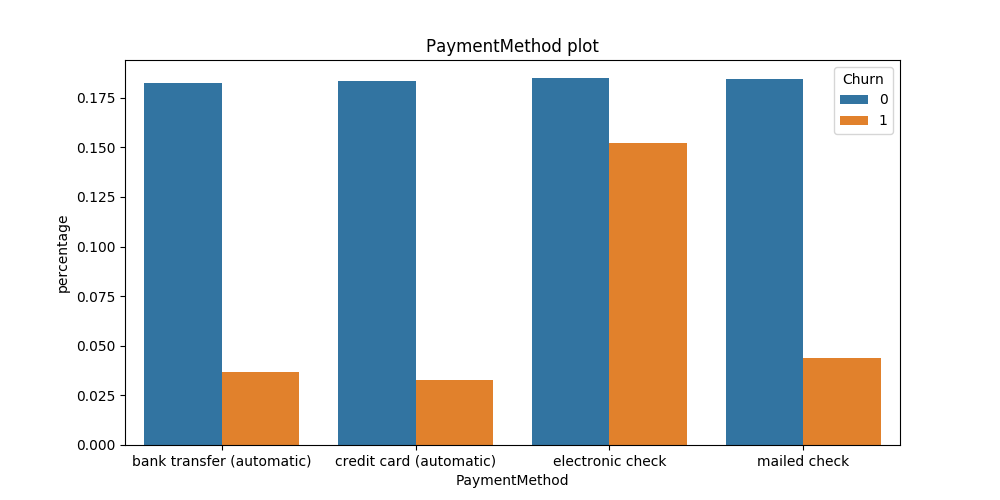

A taxa de *Churn* dos serviços de internet (*InternetService*) possui uma
variação significativa, sendo 71% para o serviço *fiber optic* e 23% do serviço
*dsl*. Apenas 8% de *Churn* para consumidores que não possuem nenhum dos dois
serviços.
 
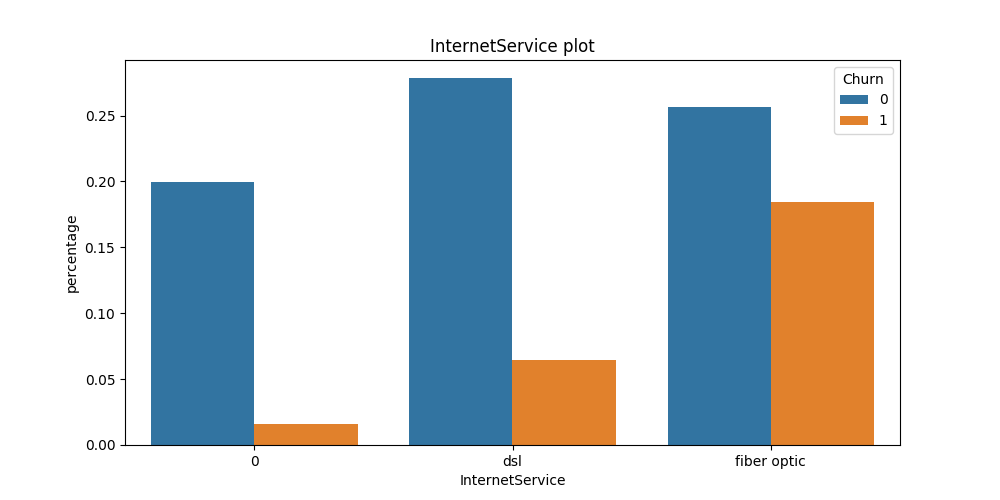

Clientes que adquirem os serviços adicionais de *OnlineBackup*,
 *OnlineSecurity*, *DeviceProtection* e *TechSupport* apresentam menor
 taxa de *Churn*, conforme as quatro figuras a seguir: 

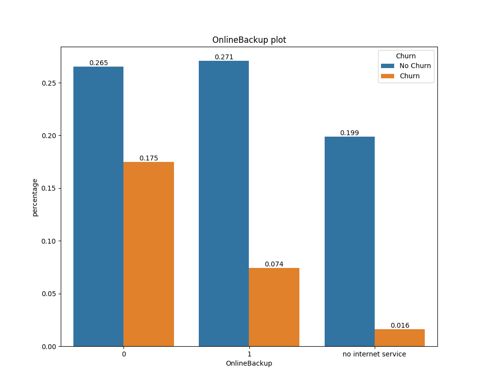
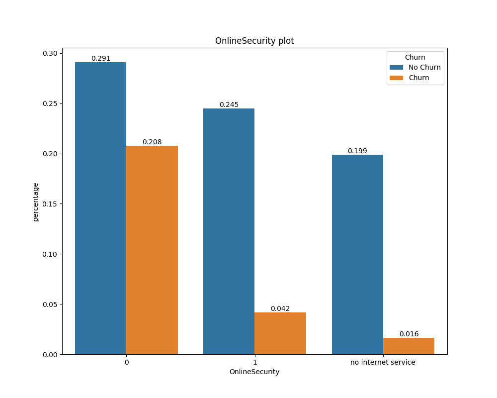
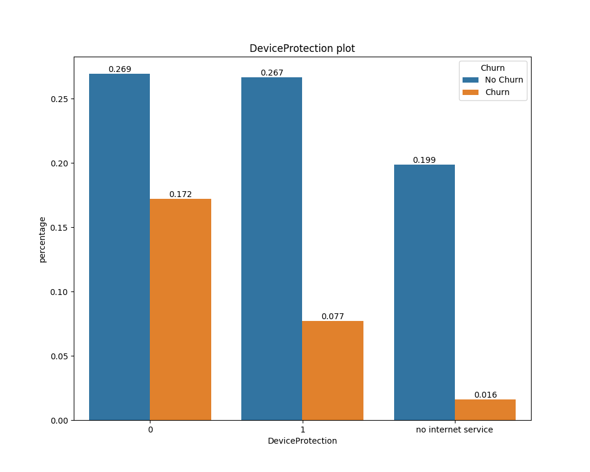
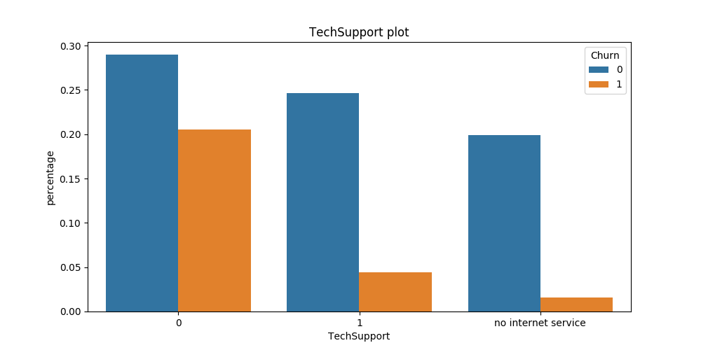


Os dados relacionados à assinatura de serviços de telefonia demonstram que a
grande maioria dos clientes possui um serviço contratado, porém esta variável 
não tem relação direta com *Churn*.

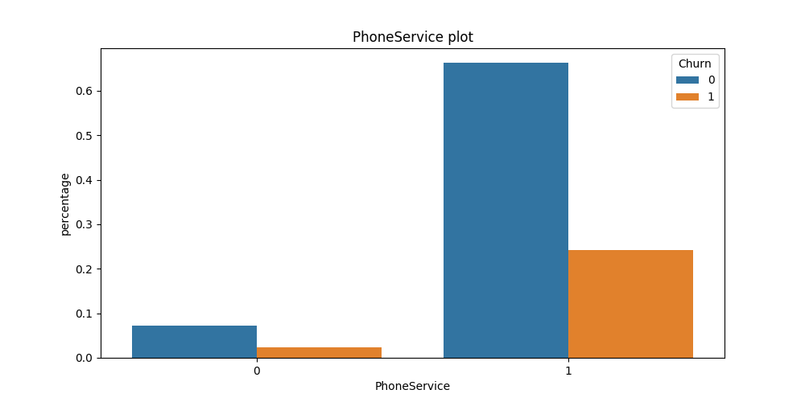

O aumento da taxa de *Churn* quando se trata de comparar a contratação de
múltiplas linhas telefônicas (*MultipleLines*) em relação à contratar apenas
linha é de apenas 7%, não sendo então esta variável um fator muito discriminante. 

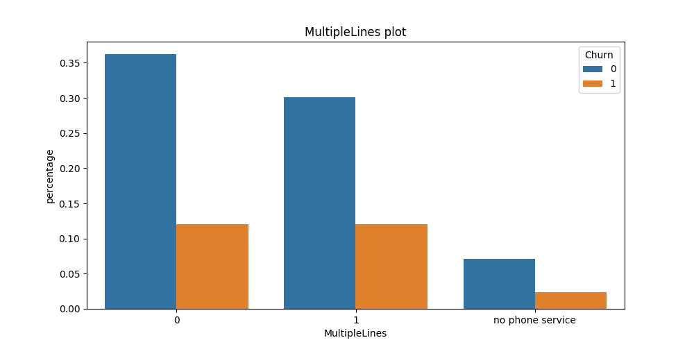

As contratações ou não dos serviços de  *StreamingTV* e *StreamingMovies* 
apresentam razão entre *Churn* e *No Churn* semelhantes, não sendo estes então
atributos descritivos para inferir o *Churn*, conforme as duas figuras abaixo:

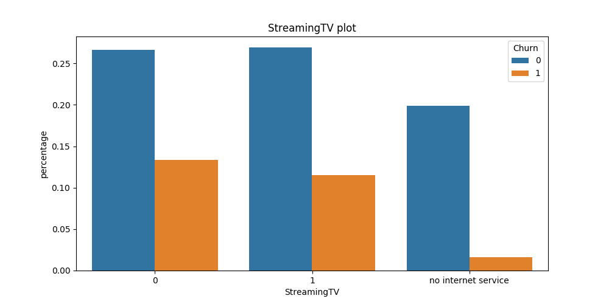
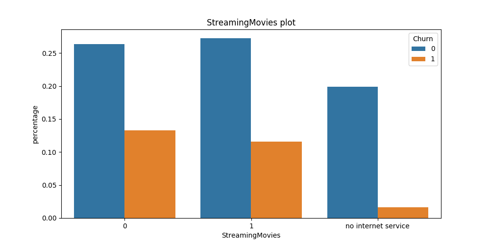


Uma vez reportadas todas as variáveis qualitativas, nas figuras a seguir são
expostas a relação de *Churn* dos dados quantitativos, individualmente.

Observando a distribuição de densidade do atributo *tenure* na figura abaixo, é
nítida sua relevante contribuição para o *Churn*, destacando um pico 
enquanto valores de *tenure* são iniciais.


O atributo *MonthlyCharges* apresenta um pico na variável *No Churn* acerca do
valor 20 (eixo horizontal), enquanto o *Churn* é uma crescente que atinge altos
valores principalmente entre as faixas de 60 à 110. Conforme a figura abaixo,
pode-se inferir que este atributo é um forte indicador de *Churn*.


Conforme a figura abaixo, é possível identificar uma maior influência no
*Churn* em valores mais baixos de *TotalCharges*, sendo então este atributo
relevante para análise de *Churn*.


A figura a seguir demonstra o grau de correlação entre os atributos da base de
dados, sendo possível identificar uma maior interseção entre os elementos
demarcados em azul escuro na região central da figura.

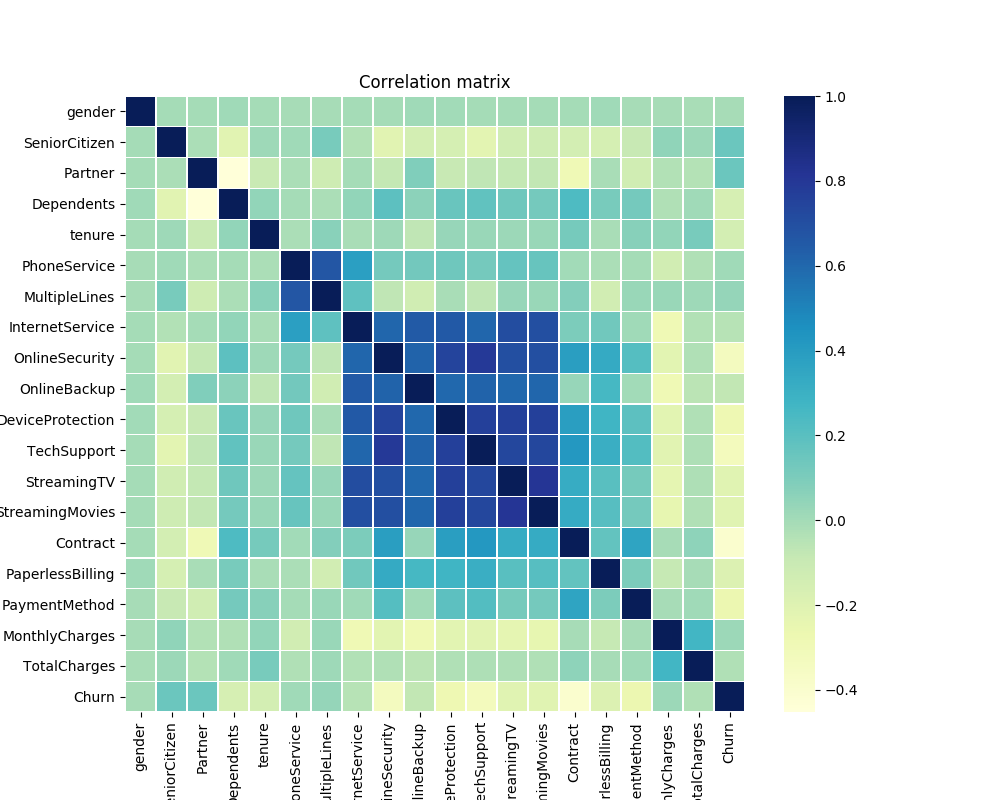

#### Modelo de predição de Churn

Foi empregado o modelo de regressão logística para estimar a probabilidade de
*Churn*, visando inferir a probabilidade de *Churn* para  dado uma nova entrada
(novo cliente).

A base de dados foi então dividida aleatoriamente nos subconjuntos de treino e
validação (70% e 30%, respectivamente) e o modelo empregado não sofreu
alterações de hiper parâmetros.

O modelo resultou nas seguintes métricas para as classes 0 (*No Churn*) e 1
(*Churn*):

|              precision | recall | f1-score | support|
| --- | --- | --- | --- |
|           0     | 0.86    | 0.88    | 0.87     | 1557|
|           1     | 0.63    | 0.57    | 0.60     |  543|
|    accuracy     |         |         | 0.80     | 2100|
|   macro avg     | 0.74    | 0.73    | 0.74     | 2100|
|weighted avg     | 0.80    | 0.80    | 0.80     | 2100|

A acurácia média do modelo foi de 0.803.

Na matriz de confusão é demonstrado que, para o total de 2100 amostras de
testes deste experimento, 1376 são verdadeiros positivos e 312 são falsos
  negativos.
  O modelo obteve 181 falsos negativos e 231 verdadeiros negativos.

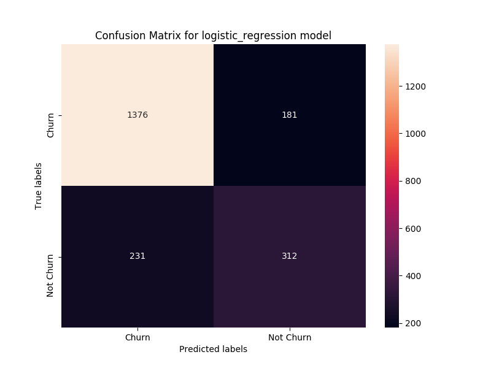

### Considerações Finais

A base de dados utilizada apresenta atributos que podem influenciar no *Churn*
de clientes, em especial as variáveis contínuas *tenure*, *MontlyCharges* e
*TotalCharges*, conforme demonstrados anteriormente nos gráficos de densidade,
além de algumas variáveis categóricas, como *Contract (Month-to-month),
InternetService (fiber optic), PaymentMethod (electronic check) e
SeniorCitizen*
Foi gerado ainda um modelo de predição de *Churn* como baseline,
o qual obteve acurácia de 80%.
=======
# airbnb
>>>>>>> Initial commit
