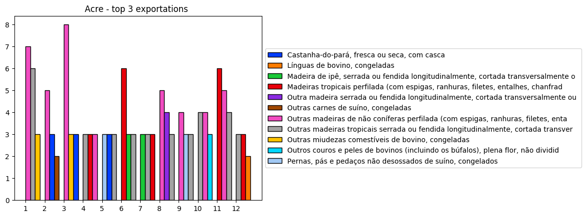
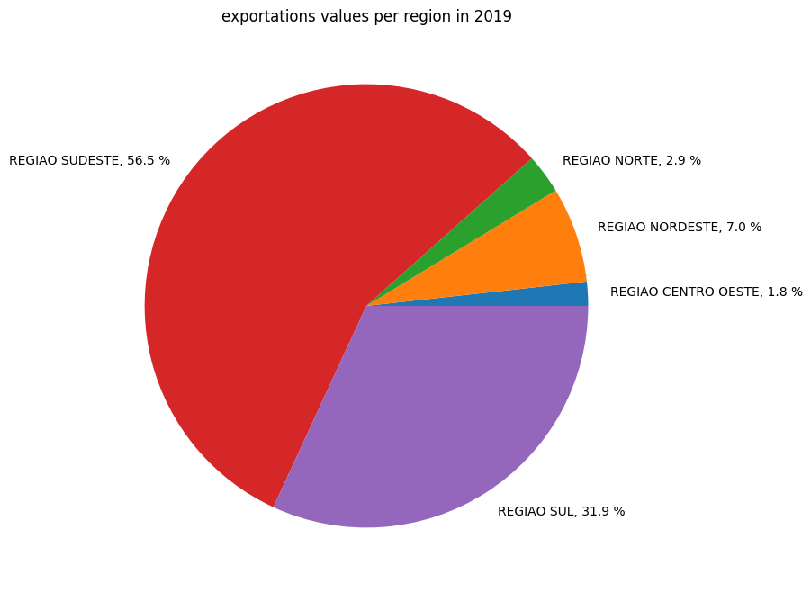
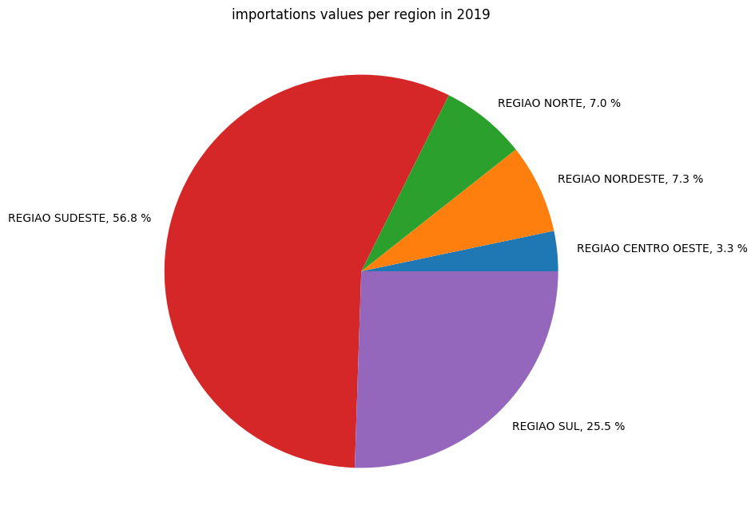

# Análise da base de dados do Comércio exterior brasileiro

Este repositório tem como finalidade analisar os dados públicos de importação e 
exportação do Brasil fornecidos pelo
[Ministério da Economia](http://www.mdic.gov.br/index.php/comercio-exterior/estatisticas-de-comercio-exterior/base-de-dados-do-comercio-exterior-brasileiro-arquivos-para-download)


## Instalação

*use python >= 3.6*
```
pip3 install -r requirements.txt
```

## Download e extração da base de dados utilizada 
```
wget http://www.mdic.gov.br/balanca/bd/comexstat-bd/ncm/EXP_COMPLETA.zip
wget http://www.mdic.gov.br/balanca/bd/comexstat-bd/ncm/IMP_COMPLETA.zip
unzip EXP_COMPLETA.zip
unzip IMP_COMPLETA.zip
mv EXP_COMPLETA.csv IMP_COMPLETA.csv data/
mkdir models
```

## Como executar
```
python3 main.py
```


## Saída

O arquivo de
[log](https://github.com/luanps/comex_stat/blob/51d377f11d2713f9cb1c5daed11010f2541ccfd0/log.txt)
salva a descrição das etapas executadas, 
possibilitando acompanhar todas as etapas empregadas na análise, tais como o
[pré-processamento](https://github.com/luanps/comex_stat/blob/51d377f11d2713f9cb1c5daed11010f2541ccfd0/log.txt#1),
[exploração de dados](https://github.com/luanps/comex_stat/blob/51d377f11d2713f9cb1c5daed11010f2541ccfd0/log.txt#L1311)
e
[treinamento e validação](https://github.com/luanps/comex_stat/blob/51d377f11d2713f9cb1c5daed11010f2541ccfd0/log.txt#L1558-1595)
dos modelos de regressão empregados.

Além disso, são gerados os
[gráficos](https://github.com/luanps/comex_stat/tree/51d377f11d2713f9cb1c5daed11010f2541ccfd0/plots),
necessários para solucionar as perguntas abaixo.


## Perguntas:


#### a) Mostre qual os top 3 produtos mais exportados por estado nos anos de 2017, 2018 e 2019

Os 3 produtos mais exportados (leia-se com maior quantidade de de itens
exportados) estão dispostos em uma sequência de gráficos de barras, 
aonde cada estado possui um gráfico para melhor visualização.

Como exemplo, segue abaixo o gráfico do estado de Santa Catarina.
O eixo vertical representa o quantitativo de produtos, enquanto
no eixo horizontal estão agrupados os top 3 produtos mais exportados
para os anos 2017, 2018 e 2019.


 Os gráficos dos demais estados e DF estão dispostos no diretório
 `plots/exportations/barplot/CO_ANO_*`, e podem também ser acessados abaixo:


[Acre](plots/exportations/barplot_CO_ANO_Acre.png)
[Alagoas](plots/exportations/barplot_CO_ANO_Alagoas.png)
[Amapá](plots/exportations/barplot_CO_ANO_Amapá.png)
[Amazonas](plots/exportations/barplot_CO_ANO_Amazonas.png)
[Bahia](plots/exportations/barplot_CO_ANO_Bahia.png)
[Ceará](plots/exportations/barplot_CO_ANO_Ceará.png)
[Distrito Federal](plots/exportations/barplot_CO_ANO_Distrito%20Federal.png)
[Espírito Santo](plots/exportations/barplot_CO_ANO_Espírito%20Santo.png)
[Goiás](plots/exportations/barplot_CO_ANO_Goiás.png)
[Maranhão](plots/exportations/barplot_CO_ANO_Maranhão.png)
[Mato Grosso do Sul](plots/exportations/barplot_CO_ANO_Mato%20Grosso%20do%20Sul.png)
[Mato Grosso](plots/exportations/barplot_CO_ANO_Mato%20Grosso.png)
[Minas Gerais](plots/exportations/barplot_CO_ANO_Minas%20Gerais.png)
[Paraíba](plots/exportations/barplot_CO_ANO_Paraíba.png)
[Paraná](plots/exportations/barplot_CO_ANO_Paraná.png)
[Pará](plots/exportations/barplot_CO_ANO_Pará.png)
[Pernambuco](plots/exportations/barplot_CO_ANO_Pernambuco.png)
[Piauí](plots/exportations/barplot_CO_ANO_Piauí.png)
[Rio de Janeiro](plots/exportations/barplot_CO_ANO_Rio%20de%20Janeiro.png)
[Rio Grande do Norte](plots/exportations/barplot_CO_ANO_Rio%20Grande%20do%20Norte.png)
[Rio Grande do Sul](plots/exportations/barplot_CO_ANO_Rio%20Grande%20do%20Sul.png)
[Rondônia](plots/exportations/barplot_CO_ANO_Rondônia.png)
[Roraima](plots/exportations/barplot_CO_ANO_Roraima.png)
[Santa Catarina](plots/exportations/barplot_CO_ANO_Santa%20Catarina.png)
[São Paulo](plots/exportations/barplot_CO_ANO_São%20Paulo.png)
[Sergipe](plots/exportations/barplot_CO_ANO_Sergipe.png)
[Tocantins](plots/exportations/barplot_CO_ANO_Tocantins.png)

  
#### b) Mostre qual os top 3 produtos mais importados por estado nos anos de 2017, 2018 e 2019

Os 3 produtos mais importados (leia-se com maior quantidade de de itens
importados) estão dispostos em uma sequência de gráficos de barras, 
seguindo a mesma lógica empregada na solução da pergunta anterior.

Como exemplo, segue abaixo o gráfico do estado de Santa Catarina.
O eixo vertical representa o quantitativo de produtos, enquanto
no eixo horizontal estão agrupados os top 3 produtos mais importados
para os anos 2017, 2018 e 2019.


 Os gráficos dos demais estados e DF estão dispostos no diretório
 `plots/importations/barplot/CO_ANO_*`, e podem também ser acessados abaixo:

[Acre](plots/importations/barplot_CO_ANO_Acre.png)
[Alagoas](plots/importations/barplot_CO_ANO_Alagoas.png)
[Amapá](plots/importations/barplot_CO_ANO_Amapá.png)
[Amazonas](plots/importations/barplot_CO_ANO_Amazonas.png)
[Bahia](plots/importations/barplot_CO_ANO_Bahia.png)
[Ceará](plots/importations/barplot_CO_ANO_Ceará.png)
[Distrito Federal](plots/importations/barplot_CO_ANO_Distrito%20Federal.png)
[Espírito Santo](plots/importations/barplot_CO_ANO_Espírito%20Santo.png)
[Goiás](plots/importations/barplot_CO_ANO_Goiás.png)
[Maranhão](plots/importations/barplot_CO_ANO_Maranhão.png)
[Mato Grosso do Sul](plots/importations/barplot_CO_ANO_Mato%20Grosso%20do%20Sul.png)
[Mato Grosso](plots/importations/barplot_CO_ANO_Mato%20Grosso.png)
[Minas Gerais](plots/importations/barplot_CO_ANO_Minas%20Gerais.png)
[Paraíba](plots/importations/barplot_CO_ANO_Paraíba.png)
[Paraná](plots/importations/barplot_CO_ANO_Paraná.png)
[Pará](plots/importations/barplot_CO_ANO_Pará.png)
[Pernambuco](plots/importations/barplot_CO_ANO_Pernambuco.png)
[Piauí](plots/importations/barplot_CO_ANO_Piauí.png)
[Rio de Janeiro](plots/importations/barplot_CO_ANO_Rio%20de%20Janeiro.png)
[Rio Grande do Norte](plots/importations/barplot_CO_ANO_Rio%20Grande%20do%20Norte.png)
[Rio Grande do Sul](plots/importations/barplot_CO_ANO_Rio%20Grande%20do%20Sul.png)
[Rondônia](plots/importations/barplot_CO_ANO_Rondônia.png)
[Roraima](plots/importations/barplot_CO_ANO_Roraima.png)
[Santa Catarina](plots/importations/barplot_CO_ANO_Santa%20Catarina.png)
[São Paulo](plots/importations/barplot_CO_ANO_São%20Paulo.png)
[Sergipe](plots/importations/barplot_CO_ANO_Sergipe.png)
[Tocantins](plots/importations/barplot_CO_ANO_Tocantins.png)


#### c) Mostre qual os top 3 produtos exportados em cada mês de 2019 por estado


Os 3 produtos mais exportados por mês (leia-se com maior quantidade de de itens
exportados) estão dispostos em uma sequência de gráficos de barras, 
aonde cada estado possui um gráfico para melhor visualização.

Como exemplo, segue abaixo o gráfico do estado de Santa Catarina.
O eixo vertical representa o quantitativo de produtos, enquanto
no eixo horizontal estão agrupados os top 3 produtos mais exportados
para cada mês do ano de 2019.


É possível notar que, uma vez que esta análise é realizada mês a mês, os estados
com menor quantitativo de exportações apresentam uma grande variabilidade
na lista de top 3 produtos,  como exemplo abaixo estado do Acre:



Os gráficos dos demais estados e DF estão dispostos no diretório
 `plots/exportations/barplot/CO_MES_*`, e podem também ser acessados abaixo:

[Acre](plots/exportations/barplot_CO_MES_Acre.png)
[Alagoas](plots/exportations/barplot_CO_MES_Alagoas.png)
[Amapá](plots/exportations/barplot_CO_MES_Amapá.png)
[Amazonas](plots/exportations/barplot_CO_MES_Amazonas.png)
[Bahia](plots/exportations/barplot_CO_MES_Bahia.png)
[Ceará](plots/exportations/barplot_CO_MES_Ceará.png)
[Distrito Federal](plots/exportations/barplot_CO_MES_Distrito%20Federal.png)
[Espírito Santo](plots/exportations/barplot_CO_MES_Espírito%20Santo.png)
[Goiás](plots/exportations/barplot_CO_MES_Goiás.png)
[Maranhão](plots/exportations/barplot_CO_MES_Maranhão.png)
[Mato Grosso do Sul](plots/exportations/barplot_CO_MES_Mato%20Grosso%20do%20Sul.png)
[Mato Grosso](plots/exportations/barplot_CO_MES_Mato%20Grosso.png)
[Minas Gerais](plots/exportations/barplot_CO_MES_Minas%20Gerais.png)
[Paraíba](plots/exportations/barplot_CO_MES_Paraíba.png)
[Paraná](plots/exportations/barplot_CO_MES_Paraná.png)
[Pará](plots/exportations/barplot_CO_MES_Pará.png)
[Pernambuco](plots/exportations/barplot_CO_MES_Pernambuco.png)
[Piauí](plots/exportations/barplot_CO_MES_Piauí.png)
[Rio de Janeiro](plots/exportations/barplot_CO_MES_Rio%20de%20Janeiro.png)
[Rio Grande do Norte](plots/exportations/barplot_CO_MES_Rio%20Grande%20do%20Norte.png)
[Rio Grande do Sul](plots/exportations/barplot_CO_MES_Rio%20Grande%20do%20Sul.png)
[Rondônia](plots/exportations/barplot_CO_MES_Rondônia.png)
[Roraima](plots/exportations/barplot_CO_MES_Roraima.png)
[Santa Catarina](plots/exportations/barplot_CO_MES_Santa%20Catarina.png)
[São Paulo](plots/exportations/barplot_CO_MES_São%20Paulo.png)
[Sergipe](plots/exportations/barplot_CO_MES_Sergipe.png)
[Tocantins](plots/exportations/barplot_CO_MES_Tocantins.png)


#### d) Representatividade em valor de exportação por estado no ano de 2019 em relação ao total exportado pelo país no mesmo ano.

A tabela abaixo relata a proporção do valor obtido na exportação de produtos
do ano de 2019 para cada UF em relação ao total exportado pelo país, em ordem
decrescente.

Percebe-se que, somete o estado de São Paulo foi responsável por 42.90%
do valor total de exportações, atingindo mais do que o dobro do segundo
estado (Rio Grande do Sul, com 13,18%).


| NO_REGIAO           | NO_UF               |   value |   proportion |
|:--------------------|:--------------------|--------:|-------------:|
| REGIAO SUDESTE      | São Paulo           |  607762 |   42.9036    |
| REGIAO SUL          | Rio Grande do Sul   |  186783 |   13.1855    |
| REGIAO SUL          | Santa Catarina      |  140253 |    9.90084   |
| REGIAO SUL          | Paraná              |  124685 |    8.80185   |
| REGIAO SUDESTE      | Rio de Janeiro      |   75342 |    5.3186    |
| REGIAO SUDESTE      | Minas Gerais        |   68444 |    4.83165   |
| REGIAO SUDESTE      | Espírito Santo      |   49102 |    3.46624   |
| REGIAO NORDESTE     | Bahia               |   29678 |    2.09505   |
| REGIAO NORDESTE     | Maranhão            |   23273 |    1.6429    |
| REGIAO NORDESTE     | Ceará               |   19378 |    1.36795   |
| REGIAO NORTE        | Pará                |   17553 |    1.23911   |
| REGIAO NORTE        | Amazonas            |   14864 |    1.04929   |
| REGIAO CENTRO OESTE | Goiás               |   10204 |    0.720328  |
| REGIAO NORDESTE     | Pernambuco          |   10155 |    0.716869  |
| REGIAO NORDESTE     | Alagoas             |    9908 |    0.699433  |
| REGIAO CENTRO OESTE | Mato Grosso do Sul  |    7005 |    0.494502  |
| REGIAO CENTRO OESTE | Mato Grosso         |    6240 |    0.440498  |
| REGIAO NORDESTE     | Rio Grande do Norte |    3086 |    0.217849  |
| REGIAO NORTE        | Rondônia            |    2914 |    0.205707  |
| REGIAO NORTE        | Roraima             |    2459 |    0.173587  |
| REGIAO NORDESTE     | Paraíba             |    1654 |    0.11676   |
| REGIAO CENTRO OESTE | Distrito Federal    |    1416 |    0.0999593 |
| REGIAO NORTE        | Tocantins           |    1093 |    0.0771578 |
| REGIAO NORTE        | Amapá               |    1060 |    0.0748283 |
| REGIAO NORDESTE     | Sergipe             |     900 |    0.0635334 |
| REGIAO NORTE        | Acre                |     764 |    0.0539328 |
| REGIAO NORDESTE     | Piauí               |     602 |    0.0424968 |

Na primeira coluna da tabela acime é possível identificar que os estados que 
mais contribuíram estão localizados em duas regiões do país, sul e sudeste,
ofuscando as demais regiões.
Desta forma, é interessante também analisar a proporção de exportações por
região do país, assim como a representatividade de cada estado em relação à
sua região pertencente.

O gráfico abaixo relata a proporção de valor de exportações no ano de 2019
para cada região geográfica do Brasil:



Abaixo estão dispostos os links para acesso aos gráficos que relatam a
proporção de valor de exportação obtido por estado em relação à sua região.

[Sudeste](plots/exportations/piechart_values_REGIAO%20SUDESTE_2019.png)
[Sul](plots/exportations/piechart_values_REGIAO%20SUL_2019.png)
[Nordeste](plots/exportations/piechart_values_REGIAO%20NORDESTE_2019.png)
[Norte](plots/exportations/piechart_values_REGIAO%20NORTE_2019.png)
[Centro Oeste](plots/exportations/piechart_values_REGIAO%20CENTRO%20OESTE_2019.png)


#### e) Representatividade em valor de importação por estado no ano de 2019 em relação ao total importado pelo país no mesmo ano.

A análise realizada nesta questão segue o mesmo princípio da anterior, 
relatando a proporção de valor obtido pela importação para cada UF
em relação ao total importado pelo país no ano de 2019, conforme tabela abaixo:


| NO_REGIAO           | NO_UF               |   value | proportion |
|:--------------------|:--------------------|--------:|-------------:|
| REGIAO SUDESTE      | São Paulo           |  750854 | 39.4836     |
| REGIAO SUL          | Santa Catarina      |  209641 | 11.024      |
| REGIAO SUL          | Paraná              |  156659 | 8.23791    |
| REGIAO SUDESTE      | Rio de Janeiro      |  145149 | 7.63266    |
| REGIAO SUDESTE      | Minas Gerais        |  141212 | 7.42563    |
| REGIAO SUL          | Rio Grande do Sul   |  119147 | 6.26534    |
| REGIAO NORTE        | Amazonas            |   93579 | 4.92085    |
| REGIAO NORDESTE     | Bahia               |   51008 | 2.68225    |
| REGIAO SUDESTE      | Espírito Santo      |   43034 | 2.26294    |
| REGIAO CENTRO OESTE | Goiás               |   40107 | 2.10903    |
| REGIAO NORDESTE     | Pernambuco          |   26676 | 1.40276    |
| REGIAO NORDESTE     | Ceará               |   24042 | 1.26425    |
| REGIAO NORTE        | Rondônia            |   20372 | 1.07126    |
| REGIAO NORDESTE     | Alagoas             |   18279 | 0.961201   |
| REGIAO NORTE        | Pará                |   15721 | 0.826688   |
| REGIAO CENTRO OESTE | Mato Grosso do Sul  |    9677 | 0.508865   |
| REGIAO CENTRO OESTE | Distrito Federal    |    8476 | 0.44571    |
| REGIAO NORDESTE     | Rio Grande do Norte |    5499 | 0.289165   |
| REGIAO NORDESTE     | Paraíba             |    5418 | 0.284905   |
| REGIAO CENTRO OESTE | Mato Grosso         |    4537 | 0.238578   |
| REGIAO NORDESTE     | Sergipe             |    4137 | 0.217544   |
| REGIAO NORDESTE     | Maranhão            |    2577 | 0.135511   |
| REGIAO NORTE        | Tocantins           |    1997 | 0.105012   |
| REGIAO NORDESTE     | Piauí               |    1760 | 0.0925496  |
| REGIAO NORTE        | Amapá               |    1562 | 0.0821377  |
| REGIAO NORTE        | Roraima             |     446 | 0.0234529  |
| REGIAO NORTE        | Acre                |     118 | 0.00620503 |


Em seguida é disposto a proporção de importação para cada região geográfica
do país, seguido pelos links de acesso aos gráficos de proporção por estado 
dentro de sua devida região.



[Sudeste](plots/importations/piechart_values_REGIAO%20SUDESTE_2019.png)
[Sul](plots/importations/piechart_values_REGIAO%20SUL_2019.png)
[Nordeste](plots/importations/piechart_values_REGIAO%20NORDESTE_2019.png)
[Norte](plots/importations/piechart_values_REGIAO%20NORTE_2019.png)
[Centro Oeste](plots/importations/piechart_values_REGIAO%20CENTRO%20OESTE_2019.png)


#### f) Faça a predição de valor de produtos (top 3) exportados por mês originados de SC para cada país de destino.

Visto que o objetivo é estimar o valor de exportação de produtos, 
foi tomado como variável dependente o campo `VL_FOB`.
Este, por sua vez, foi transformado em log para facilitar a conversão
do modelo de regressão empregado.
As variáveis dependentes utilizadas foram o mês da exportação `CO_MES`, 
país de destino `NO_PAIS` e código do produto `CO_NCM`.

Como função de custo,
foi empregada a métrica de ajuste o RMSE *(Root Mean Square Error)*, que 
consiste em aferir a diferença entre o valor estimado por dado modelo de 
regressão e o valor real. 
Por elevar o erro ao quadrado, esta é uma métrica sensível à outliers, o que
pode ser um indicadivo para iterar a análise e filtragem dos dados.
Outro fator que favoreceu o uso desta métrica é que,
por se tratar de uma avaliação universal, permite comparar o 
resultado de diferentes modelos empregados.

Foram empregados no total cinco métodos distintos de regressão, 
sendo três abordagens lineares 
[Ridge](https://github.com/luanps/comex_stat/blob/51d377f11d2713f9cb1c5daed11010f2541ccfd0/log.txt#L1558-L1563),
[Lasso](https://github.com/luanps/comex_stat/blob/51d377f11d2713f9cb1c5daed11010f2541ccfd0/log.txt#L1566-L1571),
[ElasticNet](https://github.com/luanps/comex_stat/blob/51d377f11d2713f9cb1c5daed11010f2541ccfd0/log.txt#L1574-L1580),
a regressão não-linear
[SVR](https://github.com/luanps/comex_stat/blob/51d377f11d2713f9cb1c5daed11010f2541ccfd0/log.txt#L1583-L1588)
e o modelo
[Gradient Boosting](https://github.com/luanps/comex_stat/blob/51d377f11d2713f9cb1c5daed11010f2541ccfd0/log.txt#L1590-L1594).

Uma vez separado o conjunto de dados em treino (70%) e validação (30%),
o modelo com melhor resultado é aquele que alcançou o menor erro RMSE no conjunto de 
validação, que neste caso foi utilizando o método  *SVR*, embora que todos 
tenham resultado em erros próximos entre si.

Para todos os casos foram testados diferentes combinações de hiperparâmetros,
além da avaliação cruzada, buscando o melhor ajuste possível para o
conjunto de dados existente.


#### g) Faça a predição de valor de produtos (top 3) importados por mês para SC de cada país de origem

Todas as etapas de predição na base de dadoes de exportação foram replicadas
para o cenário de importações, incluindo o uso dos modelos de regressão
[Ridge](https://github.com/luanps/comex_stat/blob/51d377f11d2713f9cb1c5daed11010f2541ccfd0/log.txt#L3154-L3159),
[Lasso](https://github.com/luanps/comex_stat/blob/51d377f11d2713f9cb1c5daed11010f2541ccfd0/log.txt#L3162-L3167),
[ElasticNet](https://github.com/luanps/comex_stat/blob/51d377f11d2713f9cb1c5daed11010f2541ccfd0/log.txt#L3170-L3176),
a regressão não-linear
[SVR](https://github.com/luanps/comex_stat/blob/51d377f11d2713f9cb1c5daed11010f2541ccfd0/log.txt#L3186-L3191)
e o modelo
[Gradient Boosting](https://github.com/luanps/comex_stat/blob/51d377f11d2713f9cb1c5daed11010f2541ccfd0/log.txt#L1590-L1594).
Nesta base, o modelo *Gradient Boosting* obteve menor erro RMSE.
